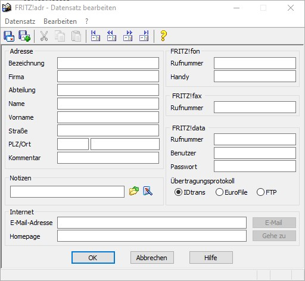

# dBASE file generator for AVM FRITZ!Adr

The class provides functions to manipulate the address database FRITZ!Adr from AVM. FRITZ!Adr is an address and phonebook for the more or less legacy programs FRITZ!Fon, FRITZ!Data and FRITZ!Com. But still in use for [FRITZ!fax (fax4box)](https://avm.de/service/fritzbox/fritzbox-7590/wissensdatenbank/publication/show/190_FRITZ-fax-fur-FRITZ-Box-installieren-und-einrichten/).



Sample image of record editing window in FRITZ!Adr (Copyright© by AVM)

The database is a dBASE III file, the default name is 'FritzAdr.dbf'.

There are three reasons for using this class:

1. because of the difficulty of implementing the outdated extension for dBase (PECL) for current PHP releases and platforms.
2. due to the fact that for the purposes that only just one file with a defined structure has to be written (no reading or manipulating data in records or whatever else is conceivable)
3. lastly, because it allows to write the data to memory instead of a local stored file. So it is possible to create the file via ftp directly in the target directory.

The DB analysis of a few FritzAdr.dbf files has surprisingly shown two variants with 19 e.g. 21 fields. Ultimately the 21er version works for me (default).

## Features

* Does create a dBase file in memory instead of writing it directly to a file (unlike the outdated PECL version)
* limited functionality: there is only one changing function: `addRecord()` beside of `getDatabase()` to receive the generated database! If you think more features are needed, fork this repo and feel free to contribute!

## Requirements

* PHP 7.0
* Composer (follow the installation guide at https://getcomposer.org/download/)

## Installation

You can install it through Composer:

```JSON
"require": {
    "blacksenator/fritzdbf": "dev-master#1.0"
},
```

or

```git clone https://github.com/blacksenator/fritzdbf.git```

## Usage

setting a new instance with the number of fields:

```PHP
$fritzDbf = new fritzdbf(19);    // number of fields
```

appending a record:

```PHP
$fritzDbf->addRecord(['NAME' => 'John', 'VORNAME' => 'Doe']);
```

receiving the data:

```PHP
$fileData = $fritzDbf->getDatabase());
```

### Samples

```PHP
use blacksenator\fritzdbf\fritzdbf;

$newData = ['BEZCHNG' => 'Maria Mustermann',   // Feld 1
            'FIRMA'   => 'Bundesdruckerei',
            'NAME'    => 'Mustermann',
            'VORNAME' => 'Erika',
            'TELEFON' => '03025980'
    ];

$fritzDbf = new fritzdbf();         // using default value 21
$fritzDbf->addRecord($newData);
file_put_contents('FritzAdr.dbf', $fritzDbf->getDatabase());
```

or directly via ftp (the reason why I coded this)

```PHP
use blacksenator\fritzdbf\fritzdbf;

$newData = ['BEZCHNG' => 'Max Mustermann',   // Feld 1
            'FIRMA'   => 'Bundesdruckerei',
            'NAME'    => 'Mustermann',
            'VORNAME' => 'Max',
            'TELEFON' => '03025980'
    ];

$ftp_conn = ftp_connect($ftpserver);
ftp_login($ftp_conn, $user, $password);
ftp_chdir($ftp_conn, $destination);
$memstream = fopen('php://memory', 'r+');

$fritzDbf = new fritzdbf();
$fritzDbf->addRecord($newData);

$memstream = $fritzDbf->getDatabase();
rewind($memstream);
ftp_fput($ftp_conn, 'FritzAdr.dbf',  $memstream, FTP_BINARY);
```

## License

This script is released under MIT license.

## Authors

Copyright© 2019 - 2021 Volker Püschel
